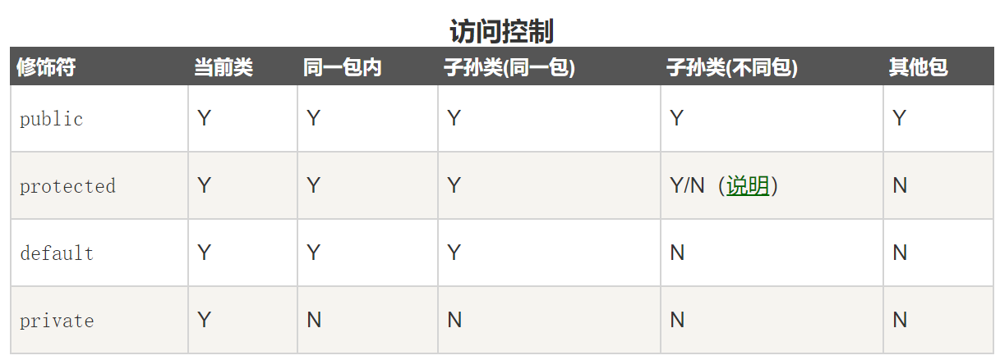

[TOC]

## Java学习

- 秦晋琦 2019年5月

---

### java的变量类型

java语言支持的变量类型：

- 类变量：独立于方法之外的变量，用static修饰

- 实例变量：独立于方法之外的变量，没有static修饰

- 局部变量：类的方法中的变量

```java
public class Variable{
    static int allClicks=0; // 类变量
    String str="Hello World"; //实例变量
    public void method(){
        int i = 0; //局部变量
    }
}
```

#### java的局部变量

- 访问修饰符不能用于局部变量

- 局部变量是在栈上分配的

- 局部变量没有默认值，所以局部变量被声明后，必须经过初始化，才可以使用

#### java的实例变量

- 实例变量在类中声明，但在方法，构造方法和语句块之外

- 当一个对象被实例化之后，每个实例变量的值就跟着确定了

- 实例变量可以声明在使用前/使用后

- 访问修饰符可以修饰实例变量

- 实例变量对于类中的方法、构造方法或者语句块是可见的。一般情况下应该把实例变量设为私有。通过使用访问修饰符可以使实例变量对子类可见

- 实例变量具有默认值。数值型变量的默认值是0，布尔型变量的默认值是false，引用类型变量的默认值是null。变量的值可以在声明时指定，也可以在构造方法中指定

- 实例变量可以直接通过变量名访问。但在静态方法以及其他类中，就应该使用完全限定名：ObejectReference.VariableName

```java
import java.io.*;
public class Employee{
    public String name; //这个实例变量对子类可见
    private double salary; //私有变量，仅在该类中可见
    // 在构造器中对name赋值
    public Employee (String empName){
        name = empName;
    }
    // 设置salary的值
    public void setSalary(double empSal){
        salary = empSal;
    }
    // 打印信息
    public void printEmp(){
        System.out.println("名字：" + name);
        System.out.println("薪水：" + salary);
    }

    public static void main(String[] args){
        Employee empOne = new Employee("QIN");
        empOne.setsalary(1000);
        empOne.printEmp();
    }
}
```

#### java的类变量（静态变量）

- 在类中以static关键字声明，但必须在方法之外

- 静态变量除了被声明为常量外很少使用，常量初始化之后不可修改

- 静态变量储存在静态储存区，很少单独使用static声明变量

- 静态变量在第一次被访问时创建，在程序结束时销毁

- 与实例变量具有相似的可见性。但为了对类的使用者可见，大多数静态变量声明为public类型

- 默认值和实例变量相似。数值型变量默认值是0，布尔型默认值是false，引用类型默认值是null。变量的值可以在声明的时候指定，也可以在构造方法中指定。此外，静态变量还可以在静态语句块中初始化

- 静态变量可以通过：ClassName.VariableName的方式访问，比如其他类想要访问该变量，可以：Employee.DEPARTMENT

- 类变量被声明为public static final类型时，类变量名称一般建议使用大写字母。如果静态变量不是public和final类型，其命名方式与实例变量以及局部变量的命名方式一致

```java
import java.io.*;

public class Employee {
    private static double salary; // 静态私有变量
    public static final String DEPARTMENT = "开发人员"; //常量
    public static void main(String[] agrs){
        salary = 10000;
        System.out.println(DEPARTMENT+"平均工资："+salary);
    }
}
```

### java修饰符

Java的修饰符主要分两类：

- 访问修饰符
- 非访问修饰符

修饰符用来定义类、方法或者变量，通常放在语句的最前端。

#### 访问控制修饰符

Java支持4种不同的访问权限

- `default`
- `private`
- `public`
- `protected`



##### 受保护的访问修饰符-protected

- **子类与基类在同一包中**：被声明为 protected 的变量、方法和构造器能被同一个包中的任何其他类访问
- **子类与基类不在同一包中**：那么在子类中，子类实例可以访问其从基类继承而来的 protected 方法，而不能访问基类实例的protected方法

protected 可以修饰数据成员，构造方法，方法成员，**不能修饰类（内部类除外）**。接口及接口的成员变量和成员方法不能声明为 protected。

##### 访问控制和继承

请注意以下方法继承的规则：

- 父类中声明为 public 的方法在子类中也必须为 public。
- 父类中声明为 protected 的方法在子类中要么声明为 protected，要么声明为 public，不能声明为 private。
- 父类中声明为 private 的方法，不能够被继承。

#### 非访问修饰符

非访问修饰符是为了实现一些其他的功能。

- `static`
- `final`
- `abstract`
- `synchronized`和`volatile`

##### static修饰符

- **静态变量：**

  static 关键字用来声明独立于对象的静态变量，无论一个类实例化多少对象，它的静态变量只有一份拷贝。 静态变量也被称为类变量。局部变量不能被声明为 static 变量。

- **静态方法：**

  static 关键字用来声明独立于对象的静态方法。静态方法不能使用类的非静态变量。静态方法从参数列表得到数据，然后计算这些数据。

#####  final修饰符

- **final变量**

  final修饰符常和static修饰符一起使用来创建类常量。被final修饰的实例变量必须显式指定初始值。

- **final方法**

  类中的final方法可以被子类继承，但不能被子类修改。

- **final类**

  final类不能被继承

##### abstract修饰符

- **抽象类**

  抽象类不能用来实例化对象，声明抽象类的唯一目的是为了将来对该类进行扩充。一个类不能同时被abstract和final修饰。

  抽象类可以包含抽象方法和非抽象方法，如果一个类包含抽象方法，那么该类一定要声明为抽象类。

- **抽象方法**

  抽象方法是一种没有任何实现的方法，该方法的具体实现由子类提供。

  ```java
  public abstract class SuperClass{
      abstract void m(); //抽象方法
  }
  
  class SubClass extends SuperClass{
      //实现抽象方法
      void m(){
          ......
      }
  }
  ```

##### synchronized修饰符

`synchronized` 关键字声明的方法同一时间只能被一个线程访问。synchronized 修饰符可以应用于四个访问修饰符。

##### transient修饰符

##### volatile修饰符


### Java运算符

#### 算术运算符

- 注意`a++`和`++a`的区别

#### 关系运算符

#### 位运算符

- `<<1`等于乘2，`>>1`等于除以2
- 按位异或的意义

#### 逻辑运算符

- 注意逻辑运算符的操作特性：`con1&&con2`当前面的条件判定为false后，不会执行后面的语句2，直接输出false

#### 赋值运算符

#### 条件运算符

- 也叫三元运算符

#### instanceof运算符

#### Java运算符优先级

- 用时查表


### Java循环结构


---

### Q

- 三种变量的访问

- 常量声明关键字的含义和用法，`final`啥意思